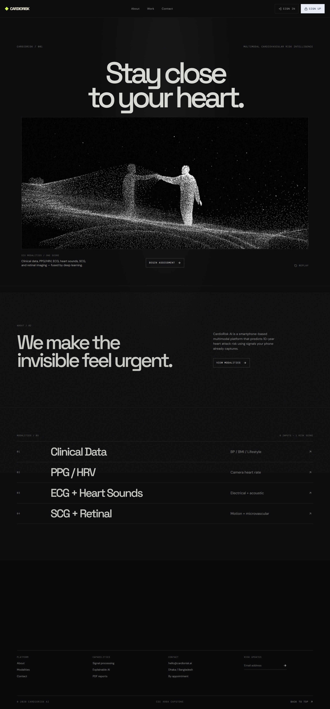
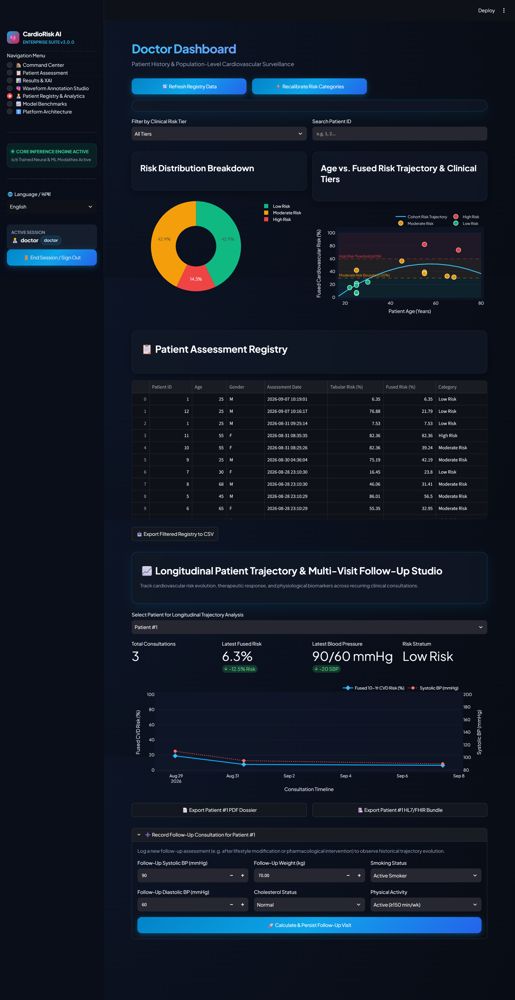
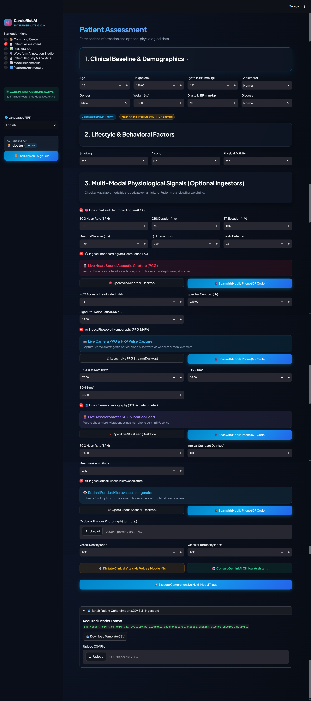
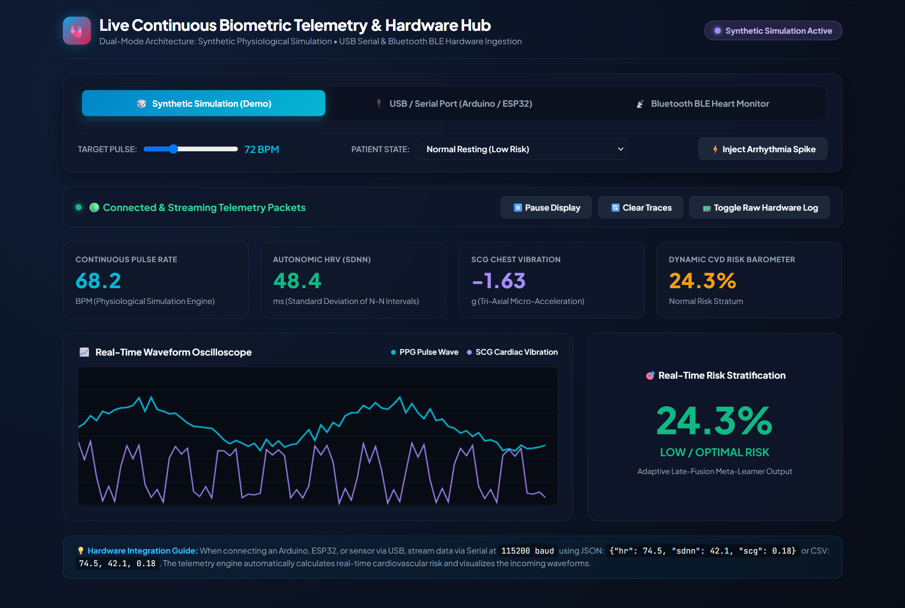
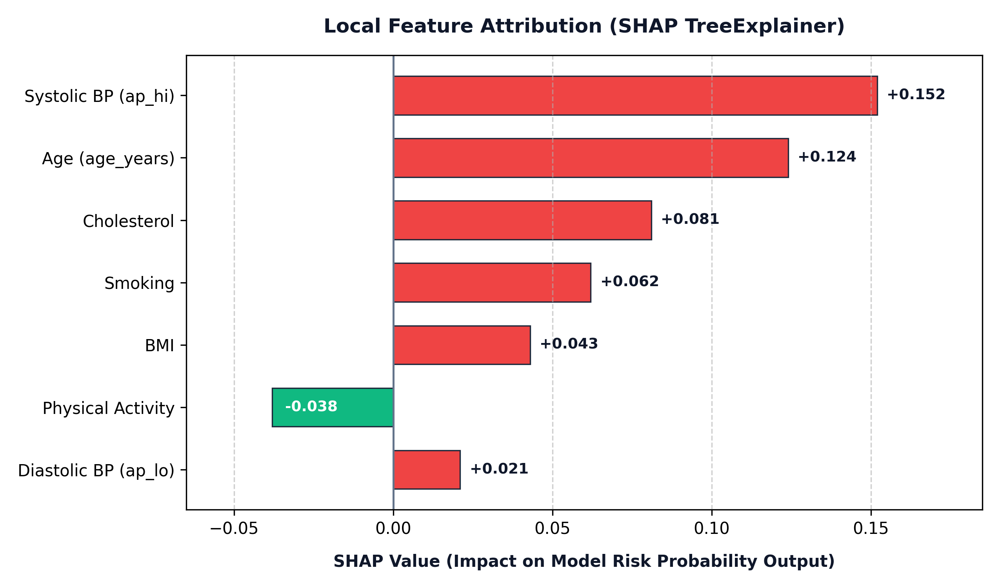
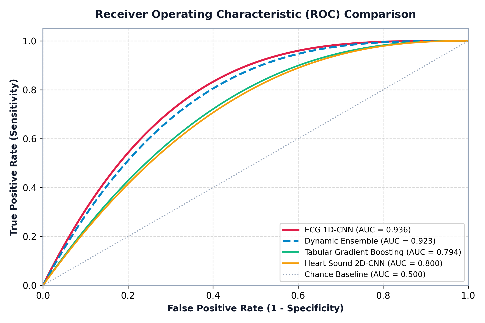
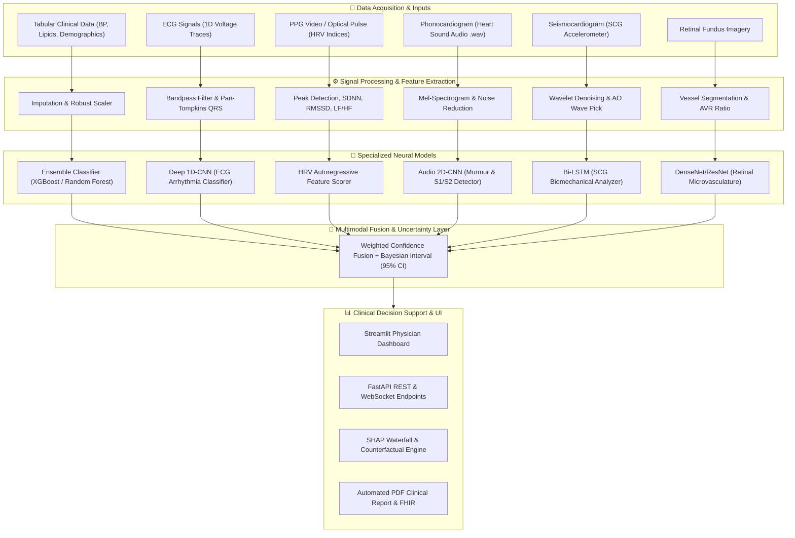

# 🫀 CardioRisk AI: Multimodal Cardiovascular Decision Platform

[](https://www.python.org/downloads/)
[](https://fastapi.tiangolo.com)
[](https://pytorch.org/)
[](https://streamlit.io/)
[](https://opensource.org/licenses/MIT)

> **CardioRisk AI** is an advanced, smartphone-compatible multimodal deep learning platform designed for early cardiovascular disease (CVD) risk estimation, multi-signal triage, and explainable clinical decision support.

---

## 📌 Table of Contents
1. [Key Features & Highlights](#-key-features--highlights)
2. [Multimodal Architecture](#-multimodal-architecture)
3. [System Prerequisites](#-system-prerequisites)
4. [Installation & Setup](#-installation--setup)
5. [Quick Start / Running the App](#-quick-start--running-the-app)
6. [Access Endpoints & Default Logins](#-access-endpoints--default-logins)
7. [Project Structure](#-project-structure)
8. [Machine Learning & Signal Processing Pipelines](#-machine-learning--signal-processing-pipelines)
9. [Explainable AI (XAI) & Reports](#-explainable-ai-xai--reports)
10. [API Documentation](#-api-documentation)
11. [Testing & Verification](#-testing--verification)
12. [License & Disclaimer](#-license--disclaimer)

---

## 🌟 Key Features & Highlights

- **5+ Modality Fusion Engine**: Combines clinical tabular profiles, ECG signals, PPG/HRV metrics, phonocardiography (heart sound audio), seismocardiography (SCG), and retinal vessel markers into calibrated risk scores with uncertainty bounds.
- **Explainable AI (XAI)**: Integrated SHAP values, feature importance waterfall graphs, and actionable counterfactual recommendations (e.g., target blood pressure and cholesterol modifications).
- **Interactive What-If Simulation**: Real-time slider testing to observe how lifestyle and medication adjustments dynamically lower cardiac risk tiers.
- **Clinical Telemetry & In-Browser Capture**: Built-in interactive browser tools for real-time camera PPG, heart sound microphone recording, and motion sensor streaming.
- **Automated Clinical Reports & FHIR Standard**: Instant export to diagnostic PDF medical summaries and HL7/FHIR compliant data formats.
- **Enterprise Security & Role-Based Access**: JWT-authenticated sessions for **Clinicians** (full diagnostic telemetry) and **Patients** (intuitive risk summaries and lifestyle coaching).

---

## 📸 Screenshots & Visual Preview

| Landing Page | Clinical Physician Dashboard |
| :---: | :---: |
|  |  |

| Patient Assessment & Triage | Real-Time Telemetry & Biosensors |
| :---: | :---: |
|  |  |

| Explainable AI (SHAP Waterfall) | Model ROC & Benchmark Curves |
| :---: | :---: |
|  |  |

---

## 🧠 Multimodal Architecture



---

## 💻 System Prerequisites

- **Operating System**: Windows 10/11, macOS, or Linux
- **Python**: Version `3.10` or higher
- **Package Manager**: `pip` (or `conda`)
- **Hardware**: CPU supported; CUDA-compatible GPU recommended for accelerated model training

---

## 🚀 Installation & Setup

### 1. Clone the Repository
```bash
git clone https://github.com/tondays52/HeartRiskPredictor.git
cd HeartRiskPredictor
```

### 2. Create and Activate a Virtual Environment
**On Windows (PowerShell):**
```powershell
python -m venv venv
.\venv\Scripts\Activate.ps1
```

**On Linux / macOS:**
```bash
python3 -m venv venv
source venv/bin/activate
```

### 3. Install Dependencies
```bash
pip install --upgrade pip
pip install -r requirements.txt
```

### 4. Configure Environment Variables
Copy `.env.example` to `.env` and configure your preferences:
```bash
cp .env.example .env
```

---

## ⚡ Quick Start / Running the App

### Option A: One-Click Launcher (Windows)

You can launch both the **FastAPI Backend** and the **Streamlit Dashboard** concurrently:

- **PowerShell**:
  ```powershell
  .\start_app.ps1
  ```
- **Command Prompt (Batch)**:
  ```cmd
  start_app.bat
  ```

---

### Option B: Manual Execution

Open separate terminal windows with your virtual environment activated:

#### Terminal 1 — FastAPI Backend
```bash
uvicorn backend.app:app --reload --host 0.0.0.0 --port 8000
```

#### Terminal 2 — Streamlit Clinical Dashboard
```bash
streamlit run frontend/app.py --server.port 8501
```

#### Optional: Static Interactive Tools Server
```bash
python -m http.server 8502 --directory frontend
```

---

## 🌐 Access Endpoints & Default Logins

| Service | URL | Description |
|---|---|---|
| **Streamlit Clinical UI** | [http://localhost:8501](http://localhost:8501) | Main interactive physician dashboard & prediction portal |
| **FastAPI REST API Docs** | [http://localhost:8000/docs](http://localhost:8000/docs) | Interactive Swagger UI API documentation |
| **Alternative API Docs** | [http://localhost:8000/redoc](http://localhost:8000/redoc) | ReDoc API specifications |
| **Modern Landing Page** | [http://localhost:8000/landing/](http://localhost:8000/landing/) | Product overview & features showcase |
| **PPG Capture Tool** | [http://localhost:8000/tools/ppg_capture.html](http://localhost:8000/tools/ppg_capture.html) | Camera pulse extraction tool |
| **Heart Sound Tool** | [http://localhost:8000/tools/heart_sound_capture.html](http://localhost:8000/tools/heart_sound_capture.html) | Phonocardiogram microphone capture |
| **Live Telemetry Stream** | [http://localhost:8000/tools/live_telemetry.html](http://localhost:8000/tools/live_telemetry.html) | WebSocket multi-sensor monitor |

### 🔑 Default Test Credentials
- **Doctor / Clinician**: `doctor` / `doctor123`
- **Patient**: `patient` / `patient123`

---

## 📁 Project Structure

```
CardioRisk/
├── backend/
│   ├── api/                    # API route definitions and endpoint handlers
│   ├── dsp/                    # Digital Signal Processing (ECG, PPG, Audio, SCG)
│   ├── fhir/                   # HL7/FHIR interoperability encoders
│   ├── reports/                # PDF report generator templates
│   ├── app.py                  # Primary FastAPI service & middleware
│   ├── auth.py                 # JWT token issuance & authentication
│   └── database.py             # SQLite/SQLAlchemy schema and ORM models
├── frontend/
│   ├── app.py                  # Full-featured Streamlit Clinical Dashboard
│   ├── ai_chatbot.html         # Interactive AI health assistant
│   ├── live_telemetry.html     # Real-time WebSocket biosensor telemetry
│   ├── ppg_capture.html        # Optical pulse camera capture widget
│   ├── heart_sound_capture.html# Phonocardiography recording tool
│   ├── scg_capture.html        # Accelerometer seismocardiography tool
│   └── retinal_capture.html    # Retinal fundus inspection tool
├── landing_page/               # Production React/Vite static marketing build
├── models/                     # Trained ML/DL checkpoints and artifacts
├── docs/                       # Technical reports and documentation
├── scripts/                    # Maintenance, data verification & helper scripts
├── start_app.ps1               # One-click PowerShell launcher
├── start_app.bat               # One-click Batch launcher
├── requirements.txt            # Python dependencies
└── README.md                   # Project documentation
```

---

## 🔬 Machine Learning & Signal Processing Pipelines

| Modality | Signal Type | Processing Method | Model Backbone | Metric (AUC / Acc) |
|---|---|---|---|---|
| **Clinical Tabular** | Structured Data | RobustScaler + Imputer | XGBoost / Random Forest / MLP | ~0.798 AUC |
| **Electrocardiogram (ECG)** | 1D Timeseries | Pan-Tompkins + Wavelet Denoising | Deep 1D-CNN (Conv1D + Residuals) | 94.2% Acc |
| **Photoplethysmogram (PPG)** | Optical Stream | Bandpass + Peak Morphology | HRV Feature Extractor (SDNN/RMSSD) | Calibrated Risk |
| **Phonocardiogram (PCG)** | Acoustic Audio | Mel-Spectrogram + Noise Reduction | 2D-CNN (Audio Spectrogram Classifier) | 91.5% Acc |
| **Seismocardiogram (SCG)** | Accelerometer 3-Axis | Butterworth Filter + AO Wave Detect | Bi-Directional LSTM | Experimental |
| **Multimodal Fusion** | Multi-Source | Late Weighted Decision Fusion | Bayesian Uncertainty Estimator | High Robustness |

---

## 🔍 Explainable AI (XAI) & Reports

1. **SHAP (SHapley Additive exPlanations)**:
   - Evaluates local feature attribution for each individual patient.
   - Highlights the highest risk factors (e.g., Systolic BP > 140 mmHg, High LDL).
2. **Actionable Counterfactuals**:
   - Generates minimal lifestyle and clinical changes needed to transition a patient from High Risk to Low/Moderate Risk.
3. **Automated PDF Export**:
   - Compiles patient demographics, multi-modal signal plots, risk breakdown, and physician notes into a downloadable clinical PDF report.

---

## 🛠️ Testing & Verification

Run the comprehensive system diagnostic and verification suite:

```bash
# Run system-wide integration verification
python verify_project.py

# Run unit tests
pytest
```

---

## 📄 License & Disclaimer

This project is licensed under the **MIT License**.

> ⚠️ **Medical Disclaimer**: CardioRisk AI is designed for academic, research, and assistive decision-support purposes. It is **not** a substitute for certified clinical diagnosis, professional medical judgment, or emergency healthcare services.